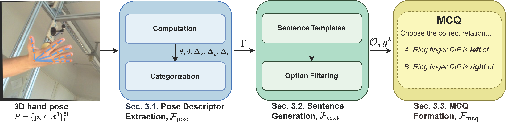

<div align="center">

# HandVQA: Diagnosing and Improving Fine-Grained Spatial Reasoning about Hands in Vision-Language Models

<p align="center">
  <strong>CVPR 2026</strong>
</p>

<p align="center">
  MD Khalequzzaman Chowdhury Sayem<sup>1*</sup>,
  Mubarrat Tajoar Chowdhury<sup>1*</sup>,
  Yihalem Yimolal Tiruneh<sup>1</sup>,
  Muneeb A. Khan<sup>1</sup>,
  Muhammad Salman Ali<sup>1</sup>,
  Binod Bhattarai<sup>2,3,4&dagger;</sup>,
  Seungryul Baek<sup>1&dagger;</sup>
</p>

<p align="center">
  <sup>1</sup>UNIST,
  <sup>2</sup>University of Aberdeen,
  <sup>3</sup>University College London,
  <sup>4</sup>Fogsphere (Redev.AI Ltd)
</p>

<p align="center">
  <sup>*</sup>Equal contribution.
  <sup>&dagger;</sup>These authors jointly supervised this work.
</p>

<p align="center">
  <a href="https://kcsayem.github.io/handvqa/"></a>
  <a href="https://huggingface.co/datasets/kcsayem/handvqa"></a>
  <a href="https://github.com/kcsayem/handvqa"></a>
</p>

</div>

## Overview

HandVQA is a large-scale, 3D-grounded benchmark for diagnosing fine-grained spatial reasoning about articulated human hands in vision-language models. Built on top of FreiHAND, InterHand2.6M, and FPHA, it contains more than 1.6 million controlled multiple-choice questions covering angles, distances, and relative positions along the X, Y, and Z axes.

<p align="center">
  
</p>

<p align="center">
  <em>HandVQA converts 3D hand joints into geometry-grounded pose descriptors and controlled multiple-choice questions.</em>
</p>

## Highlights

- 1.6M+ VQA samples grounded in 3D hand annotations.
- Five reasoning categories: angle, distance, and relative position along X, Y, and Z.
- Deterministic supervision derived directly from hand joint geometry.
- Improves downstream zero-shot transfer to hand understanding tasks.

## Benchmark Snapshot

| Component | Details |
| --- | --- |
| Source datasets | FreiHAND, InterHand2.6M, FPHA |
| Question types | Angle, Distance, Relative Position X/Y/Z |
| Supervision | Deterministic labels computed from 3D hand joints |
| Scale | 1.6M+ VQA samples |
| Format | JSONL annotations + image archives |

## Results

- Strong VLMs still struggle with subtle articulation and precise geometric reasoning about hands.
- Distance reasoning often shows a bias toward visually plausible but incorrect predictions.
- Left/right, above/below, and front/behind reasoning improve substantially with HandVQA supervision.
- Spatial grounding learned from HandVQA transfers zero-shot to gesture recognition and hand-object interaction tasks.

## Getting Started

Clone the repository:

```bash
git clone git@github.com:kcsayem/handvqa.git
cd handvqa
```

Create an environment:

```bash
conda create -n handvqa python=3.11
conda activate handvqa
```

Install downloader dependencies:

```bash
pip install requests mlcroissant
```

Download the benchmark:

```bash
python download_files.py croissant.json --out-dir HandVQA
```

The downloader supports the public Hugging Face release at [kcsayem/handvqa](https://huggingface.co/datasets/kcsayem/handvqa). Since the image archives are bundled inside a shared `data.zip`, the script reconstructs the expected `HandVQA/data/*.zip` layout automatically.

## Dataset Structure

```text
HandVQA/
|-- data/
|   |-- fpha_part_1.zip
|   |-- fpha_part_2.zip
|   |-- FreiHAND-002.zip
|   `-- InterHand2.6M_5fps_batch1.zip
|-- fpha_evaluation_angle.jsonl
|-- fpha_evaluation_distance.jsonl
|-- fpha_evaluation_relative_pos_x.jsonl
|-- fpha_evaluation_relative_pos_y.jsonl
|-- fpha_evaluation_relative_pos_z.jsonl
|-- fpha_training.jsonl
|-- freihand_evaluation_angle.jsonl
|-- freihand_evaluation_distance.jsonl
|-- freihand_evaluation_relative_pos_x.jsonl
|-- freihand_evaluation_relative_pos_y.jsonl
|-- freihand_evaluation_relative_pos_z.jsonl
|-- freihand_training.jsonl
|-- interhand_evaluation_angle.jsonl
|-- interhand_evaluation_distance.jsonl
|-- interhand_evaluation_relative_pos_x.jsonl
|-- interhand_evaluation_relative_pos_y.jsonl
|-- interhand_evaluation_relative_pos_z.jsonl
`-- interhand_training.jsonl
```

## Extract Images

```bash
python extract_images.py --data-dir HandVQA/data --out-dir HandVQA/data
```

This produces extracted folders such as `HandVQA/data/fpha`, `HandVQA/data/FreiHAND-002`, and `HandVQA/data/InterHand2.6M_5fps_batch1`.

## Training

Install [ms-swift](https://github.com/modelscope/ms-swift) using the official setup instructions, then run training from the dataset root:

```bash
cd HandVQA
CUDA_VISIBLE_DEVICES=0,1,2,3 NPROC_PER_NODE=4 \
swift sft \
    --model deepseek-ai/Janus-Pro-7B \
    --train_type lora \
    --dataset fpha_training.jsonl \
    --torch_dtype bfloat16 \
    --num_train_epochs 1 \
    --per_device_train_batch_size 1 \
    --per_device_eval_batch_size 1 \
    --learning_rate 1e-4 \
    --lora_rank 8 \
    --lora_alpha 32 \
    --target_modules all-linear \
    --gradient_accumulation_steps 16 \
    --eval_steps 1000 \
    --save_steps 50 \
    --save_total_limit 5 \
    --logging_steps 5 \
    --max_length 4096 \
    --output_dir output \
    --system 'You are a very helpful assistant. You answer everything accurately. When given a task,you strictly follow the instructions and definitions provided, without adding any extra information or assumptions.' \
    --warmup_ratio 0.05 \
    --dataloader_num_workers 4 \
    --model_author swift \
    --model_name swift-robot \
    --gradient_checkpointing False
```

## Inference

```bash
CUDA_VISIBLE_DEVICES=2 swift infer \
  --model Qwen/Qwen2.5-VL-7B-Instruct \
  --infer_backend pt \
  --temperature 0 \
  --max_new_tokens 2048 \
  --val_dataset fpha_evaluation_relative_pos_z.jsonl \
  --max_batch_size 1
```

## Evaluation

Install evaluation dependencies:

```bash
pip install pandas scikit-learn
```

Run the evaluator on prediction files:

```bash
python evaluators.py --rel_pos_z_file /your/path/to/fpha_evaluation_relative_pos_z_results.jsonl
python evaluators.py --rel_pos_x_file /your/path/to/fpha_evaluation_relative_pos_x_results.jsonl
python evaluators.py --rel_pos_y_file /your/path/to/fpha_evaluation_relative_pos_y_results.jsonl
python evaluators.py --angle_file /your/path/to/fpha_evaluation_angle_results.jsonl
python evaluators.py --distance_file /your/path/to/fpha_evaluation_distance_results.jsonl
```

## Data Generation Pipeline

The full data generation pipeline is documented in [pipeline/README.md](./pipeline/README.md).

## Citation

```bibtex
@inproceedings{sayem2026handvqa,
  title     = {HandVQA: Diagnosing and Improving Fine-Grained Spatial Reasoning about Hands in Vision-Language Models},
  author    = {Sayem, MD Khalequzzaman Chowdhury and Chowdhury, Mubarrat Tajoar and Tiruneh, Yihalem Yimolal and Khan, Muneeb A. and Ali, Muhammad Salman and Bhattarai, Binod and Baek, Seungryul},
  booktitle = {Proceedings of the IEEE/CVF Conference on Computer Vision and Pattern Recognition (CVPR)},
  year      = {2026},
  note      = {arXiv:2603.26362}
}
```
